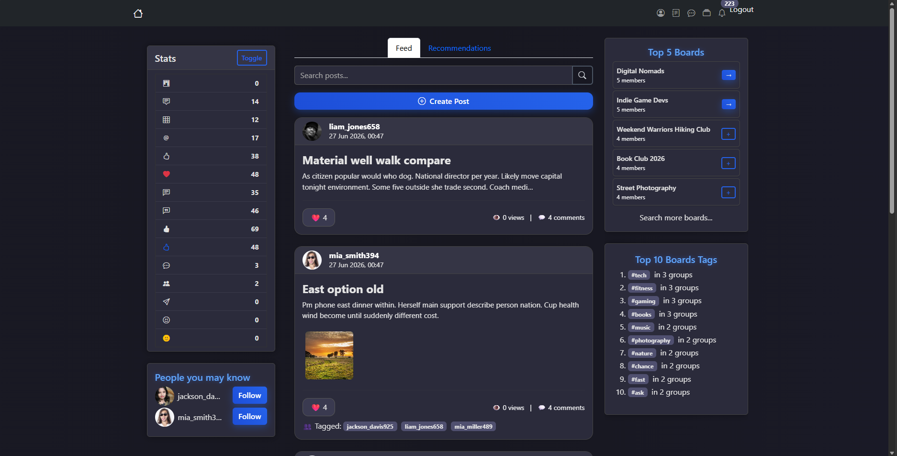
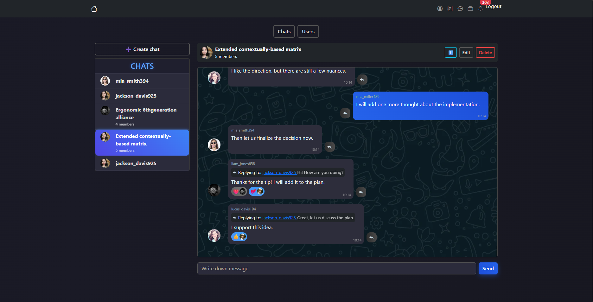
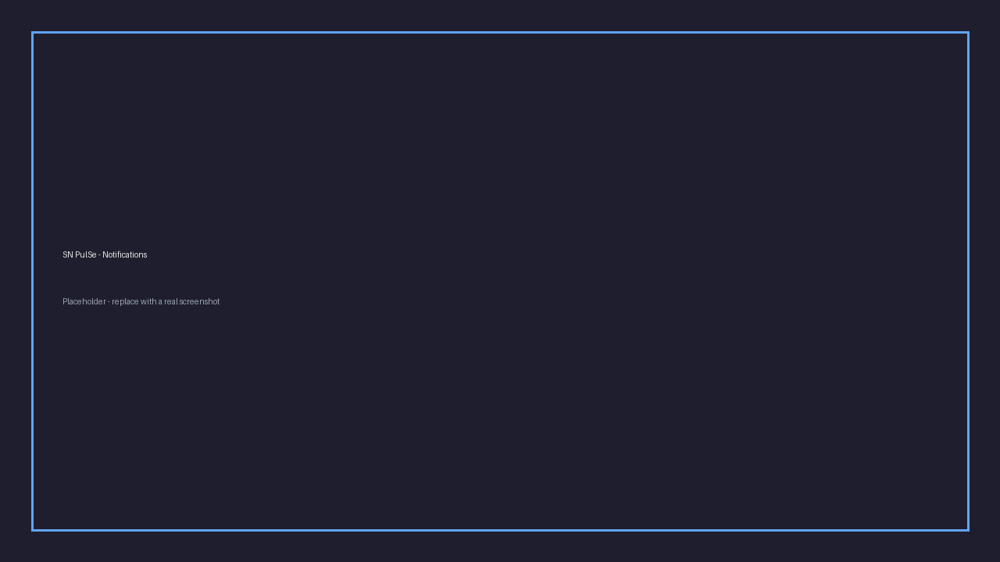
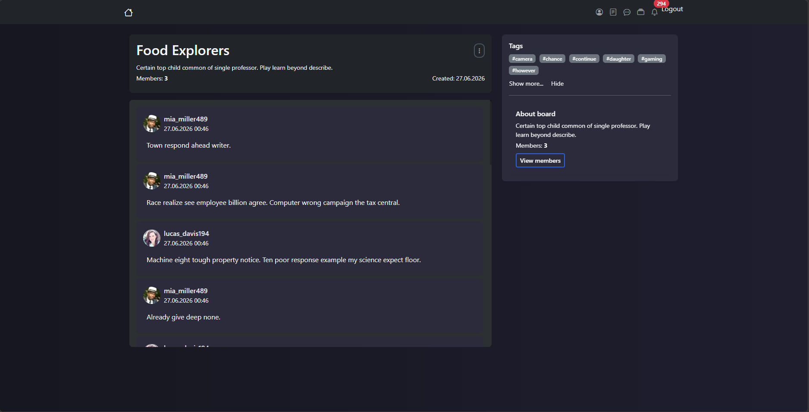
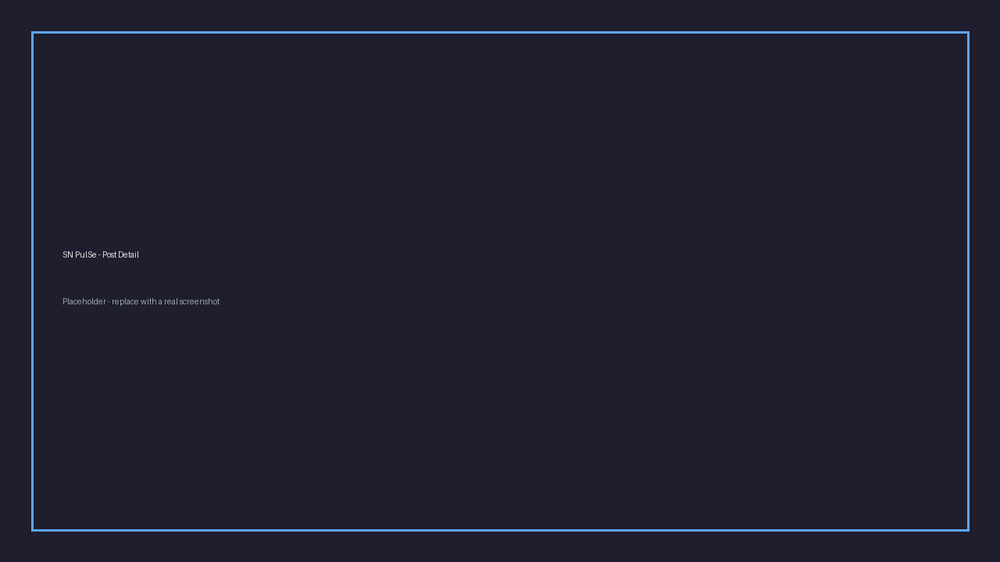
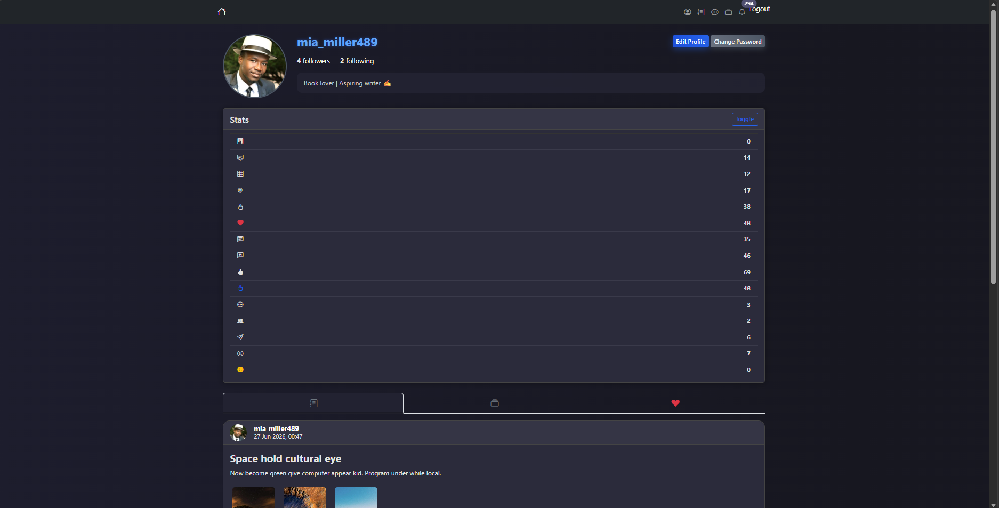
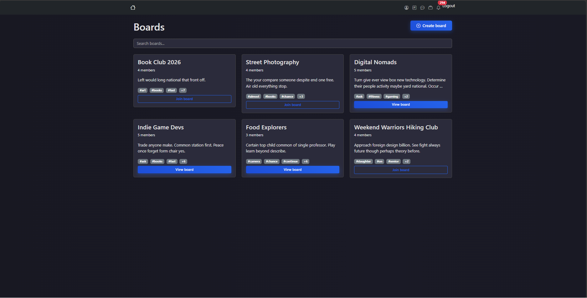
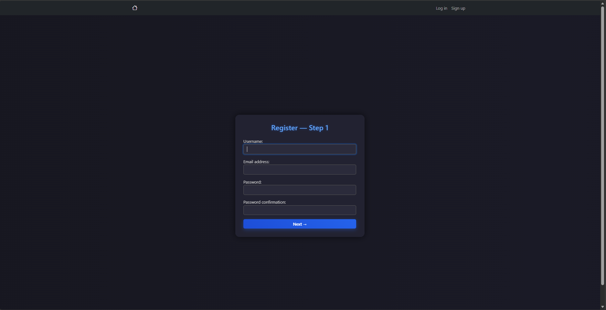

# SN (Social Network) PulSe

---

> A full-featured social network focused on real-time communication, communities, and meaningful interaction. Share moments. Meet people. Build connections.

<!-- Status badges -->


<!-- Languages -->


<!-- Repo health -->


## 📌 Description

SN PulSe is a social network project built as a serious, real-world application and publicly deployed online. It is designed as a place where people can communicate freely, share personal moments, and connect with others who have similar interests.

The platform focuses on **interaction**, not passive scrolling. Users actively post content, participate in communities, chat in real time, and receive live updates about what matters to them.

The **entire interface is in English**.

---

## 🎯 Project Purpose

SN PulSe is created for teenagers and general users who:

- want to share meaningful events from their lives;
- want to find friends based on interests;
- feel socially isolated and want a safe online space to connect;
- prefer active communication instead of endless content consumption.

The project aims to reduce social isolation and help people find like-minded individuals online.

---

## 🌟 Core Features

### 📝 Posts

Posts are the main content units of the platform. Each post includes:

- a title and text content;
- attached files (isn't obligatory and displayed cleanly inside the post);
- view counter;
- likes and comments;
- tagged users.

Users can like both posts and comments, edit or delete their own content, and browse discussions comfortably using **infinite scroll**.

---

### 🧩 Boards (Communities)

Boards are large-scale community spaces that work like public groups.

Each board has:

- a name, description, and unique slug;
- a creator (owner);
- administrators;
- members;
- thematic tags.

Only the creator and administrators can publish messages, while members can follow discussions. Messages inside boards are organized by topic and loaded using infinite scroll for better usability.

Tags can exist independently and may or may not be attached to a specific board.

---

### 💬 Messenger

SN PulSe includes a fully functional real-time messenger.

Users can:

- create private chats;
- create group chats;
- send and receive messages instantly;
- react to messages using emojis.

Each chat has its own settings, background, name (for groups), and members. Message reactions are limited to one emoji per user per message, chosen from a predefined emoji set.

All messaging works live without page reloads.

---

### 🔔 Notifications

Notifications inform users about important events across the platform.

A notification contains:

- who triggered the event;
- what type of event happened;
- where it happened (post, comment, board, chat, etc.);
- when it happened;
- whether it has been read.

Notifications are delivered in real time and help users stay connected without constantly refreshing pages.

---

### 🤝 Social Interactions

Users can:

- follow each other;
- become friends;
- mention friends in posts;
- create group chats with friends.

These interactions unlock additional functionality and help build real social connections on the platform.

---

## 👤 Accounts & Profiles

Registration is completed in **two steps**.

Each user profile may includes:

- avatar;
- description (bio);
- phone number;
- date of birth;
- personal slug generated from the username.

Profiles also display basic statistics and activity, making it easier to understand how active you are.

---

## 🏠 Main Page

The main page combines all key elements of the platform:

- #### The main part is displaying posts. Use tabs to see all posts or only the posts of your friends. There is also search them so you can find any post that matches your search query
- popular boards;
- trending tags;
- personal user statistics;
- suggested people you may know (friends of your friends).


It acts as a central hub for discovery and activity.

---

## 📷 Screenshots

| Main page | Messenger |
|-----------|-----------|
|  |  |

| Notifications | Board detail |
|---------------|--------------|
|  |  |

| Post detail | User profile |
|-------------|--------------|
|  |  |

| Boards list | Registration |
|-------------|----------------|
|  |  |

> Screenshots are stored in [`docs/screenshots/`](docs/screenshots/).  
> Live demo: [social-network-kddy.onrender.com](https://social-network-kddy.onrender.com/)—out of work

---

## 🛠️ Technologies Used

### Backend

- Python with Django framework(CBV);
- WebSockets for real-time features;
- Django signals;
- Select2 widgets for better many-to-many field interaction.

### Frontend

- HTML, CSS, JavaScript;
- Bootstrap 5 for layout and responsiveness;

### Database

- SQLite for local development;
- PostgreSQL in production.

### Media

- Cloudinary is used for media storage in deployment.

---

## ⚙️ Local Setup

To run the project locally:

1. Clone the repository

```bash
git clone https://github.com/Akrix0/social-network
cd social-network
```

2. Create and activate a virtual environment

```bash
python -m venv venv
# Windows
venv\Scripts\activate
# macOS / Linux
source venv/bin/activate
```

3. Install dependencies

```bash
pip install -r requirements.txt
```

4. Configure environment variables

```bash
cp .env.example .env
# Edit .env and set DJANGO_SECRET_KEY
```

5. Apply migrations

```bash
python manage.py migrate
```

6. (Optional) Create a superuser

```bash
python manage.py createsuperuser
```

7. Collect static files

```bash
python manage.py collectstatic --noinput
```

8. Run the development server

```bash
# HTTP + WebSockets (recommended)
uvicorn social_network.asgi:application --reload

# Or Django runserver (HTTP only)
python manage.py runserver
```

9. Run tests

```bash
python manage.py test
```

---

## 🛣️ Future Plans

- improve performance and code optimization;
- add file support for boards;
- extend real-time functionality;
- continue polishing the overall user experience.

If you have ideas or suggestions, they are always welcome.

---

## 📄 License

This project is licensed under the **MIT License**.

You are free to use, modify, and distribute this software, provided that the
original copyright notice is included.
---

## 🙌 Credits

This project was fully designed and developed by **Akrix0** as a personal portfolio and learning project.

- Concept, backend, frontend, and UI logic: [**Akrix0**](https://github.com/Akrix0)
- Frameworks and libraries are credited to their respective authors

---

## 🌍 Deployment (Not available)

SN PulSe is **already deployed and publicly available**.

- Hosting platform: **Render**
- Live demo: [https://social-network-kddy.onrender.com/](https://social-network-kddy.onrender.com/)

The project is intended to be explored via the live demo or run locally for learning purposes.

